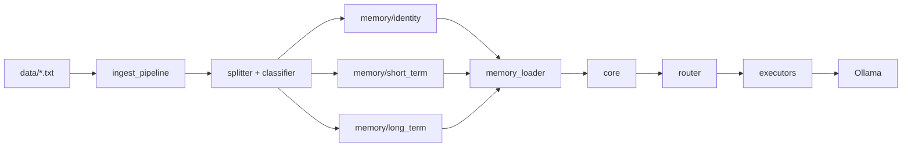

# Arquitetura (Resumo)

```mermaid
flowchart LR
  A[data/*.txt] --> B[ingest_pipeline]
  B --> C[splitter + classifier]
  C --> D[memory/identity]
  C --> E[memory/short_term]
  C --> F[memory/long_term]
  D --> G[memory_loader]
  E --> G
  F --> G
  G --> H[core]
  H --> I[router]
  I --> J[executors]
  J --> K[Ollama]
```

## Fluxo
- **Ingest**: valida, divide, classifica e grava memórias.
- **Memory loader**: sanitiza, indexa e monta contexto.
- **Core**: decide rota e chama o modelo.
